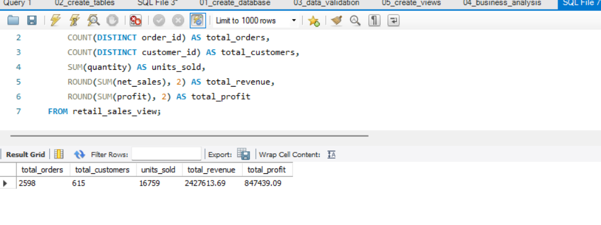
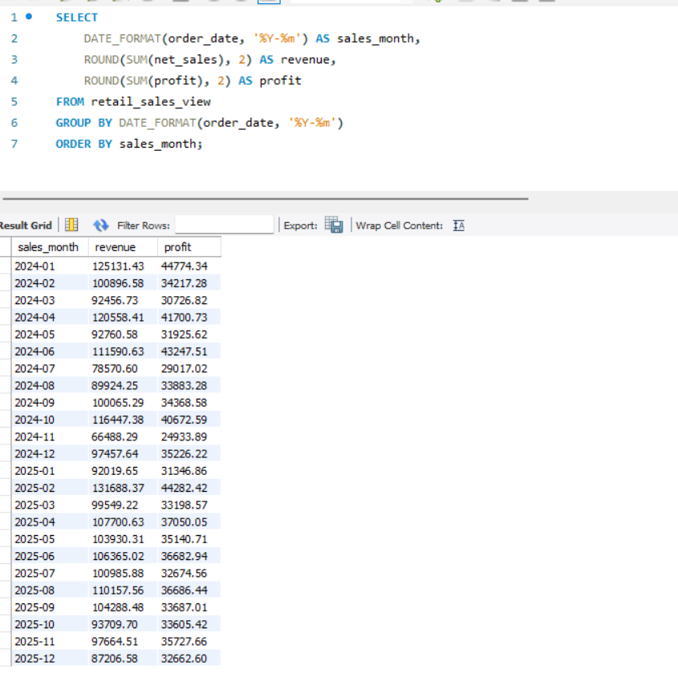
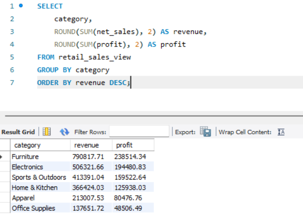

# Retail Sales Analytics

An end-to-end retail analytics portfolio project built with synthetic Canadian retail transaction data, MySQL-ready SQL scripts, normalized CSV files, and dashboard planning assets for Power BI and Tableau.

## Project goals

This project answers core retail business questions:

- How much revenue and profit is the business generating?
- Which products and categories perform best?
- Which regions have the highest sales?
- Who are the most valuable customers?
- How are sales changing month over month?
- Are discounts reducing profitability?
- Which products should the business promote or review?

## Project snapshot

- Raw transaction rows: `5,535`
- Cleaned transaction rows: `5,491`
- Customers: `615`
- Products: `120`
- Orders: `2,598`
- Date range: `2024-01-01` to `2025-12-31`
- Total revenue: `$2,427,613.69`
- Total profit: `$847,439.09`
- Profit margin: `34.91%`
- Average order value: `$934.42`
- Top category by revenue: `Furniture`
- Top region by revenue: `Central`
- Top customer by revenue: `Layla Lee`

## Folder structure

```text
Retail-Sales-Analytics/
|-- data/
|   |-- raw/
|   |   `-- retail_sales_raw.csv
|   |-- cleaned/
|   |   |-- retail_sales_cleaned.csv
|   |   |-- data_quality_report.md
|   |   |-- data_quality_report.json
|   |   `-- project_summary.json
|   `-- staging/
|       |-- customers.csv
|       |-- products.csv
|       |-- orders.csv
|       `-- order_items.csv
|-- images/
|   |-- dashboard_overview.png
|   |-- product_analysis.png
|   |-- customer_analysis.png
|   `-- workbench_results/
|       |-- kpi_query_result.png
|       |-- monthly_sales_trend_result.png
|       `-- category_performance_result.png
|-- powerbi/
|   `-- README.md
|-- tableau/
|   `-- README.md
|-- scripts/
|   |-- generate_data.py
|   `-- generate_dashboard_images.ps1
|-- sql/
|   |-- 01_create_database.sql
|   |-- 02_create_tables.sql
|   |-- 03_data_validation.sql
|   |-- 04_business_analysis.sql
|   `-- 05_create_views.sql
|-- RetailAnalystics.sql
`-- README.md
```

## Data preparation

The project includes both a raw and cleaned transaction file.

- `data/raw/retail_sales_raw.csv` contains seeded issues such as duplicate transactions, inconsistent category casing, mixed date formats, and percentage-style discounts.
- `data/cleaned/retail_sales_cleaned.csv` contains the standardized analysis-ready dataset.
- `data/staging/*.csv` contains the normalized files you can import directly into MySQL Workbench.

Detailed cleaning notes are in `data/cleaned/data_quality_report.md`.

## Database design

The data model is normalized into four tables:

```text
Customers 1 --- * Orders 1 --- * Order_Items * --- 1 Products
```

### Tables

- `customers`
- `products`
- `orders`
- `order_items`

### Analytical views

- `retail_sales_view`
- `customer_lifetime_value_view`
- `product_profitability_view`

## How to run the project

1. Open MySQL Workbench and run `sql/01_create_database.sql`.
2. Run `sql/02_create_tables.sql`.
3. Import the CSV files in `data/staging/` in this order:
   - `customers.csv`
   - `products.csv`
   - `orders.csv`
   - `order_items.csv`
4. Run `sql/03_data_validation.sql` to confirm the import is clean.
5. Run `sql/05_create_views.sql`.
6. Use `sql/04_business_analysis.sql` for KPI, trend, product, customer, and discount analysis.

## Executed SQL results

The SQL scripts were executed successfully in MySQL Workbench on `2026-07-12` after importing all four CSV files.

### Validation summary

- `customers`: `615`
- `products`: `120`
- `orders`: `2,598`
- `order_items`: `5,491`

### KPI query result

- Total orders: `2,598`
- Total customers: `615`
- Units sold: `16,759`
- Total revenue: `$2,427,613.69`
- Total profit: `$847,439.09`
- Profit margin: `34.91%`
- Average order value: `$934.42`



### Monthly sales trend

- Best revenue month: `2025-02`
- Revenue in `2025-02`: `$131,688.37`
- Profit in `2025-02`: `$44,282.42`



### Category performance

- Top category: `Furniture`
- Furniture revenue: `$790,817.71`
- Furniture profit: `$238,514.34`
- Second strongest category: `Electronics`



## Dashboard assets

The `images/` folder contains three portfolio-style PNG previews generated from the cleaned dataset:

- `dashboard_overview.png`
- `product_analysis.png`
- `customer_analysis.png`

The `images/workbench_results/` folder contains MySQL Workbench screenshots of the executed SQL analysis:

- `kpi_query_result.png`
- `monthly_sales_trend_result.png`
- `category_performance_result.png`

The `powerbi/` and `tableau/` folders contain build guides for creating the final desktop dashboards. Save your authored `.pbix` and `.twbx` files there after connecting to MySQL.

## Key insights from the generated dataset

- Revenue is concentrated in `Furniture`, which is also the strongest category for total profit.
- `2025-02` is the strongest month in the executed monthly trend query.
- `Central` is the top-performing region, making it a good candidate for regional drilldowns in dashboards.
- A small set of products is loss-making after discounting, making the discount analysis and product review queries useful immediately.
- The dataset includes more than two full years of order history, so month-over-month and year-over-year trend analysis works well.

## Rebuild the assets

If you want to regenerate the synthetic project assets locally:

```powershell
python scripts\generate_data.py
powershell -ExecutionPolicy Bypass -File scripts\generate_dashboard_images.ps1
```
